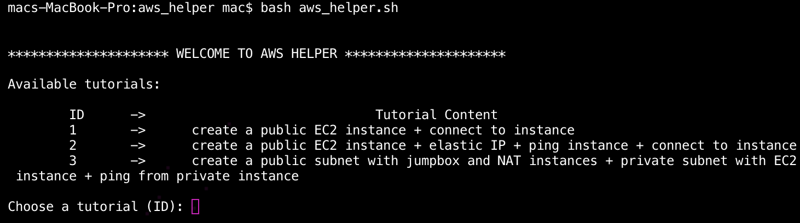
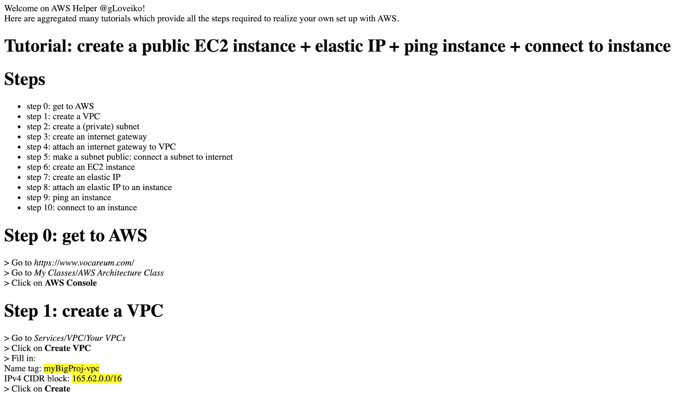

# AWS Helper

**Bash** script which generates **tutorials for AWS**. Bash script takes a tag name variable as entry to customize instances names in tutorials. Tutorials are generated as **html scripts** as such they can be loaded by web browser.

## Installation & Usage

OS X & Linux:

```sh
bash aws_helper.sh
```

<p align="left">
  
</p>

## Example of generated tutorial

<p align="left">
  
</p>
